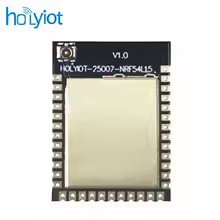
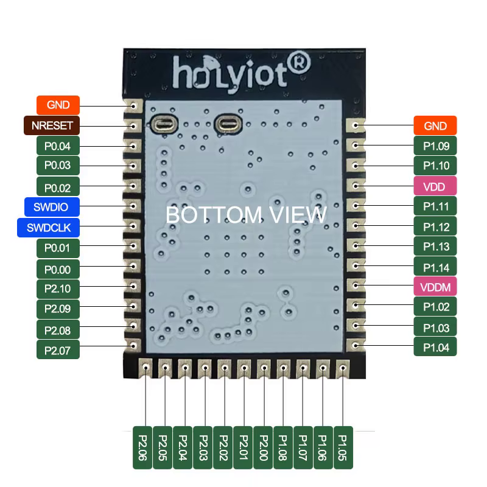
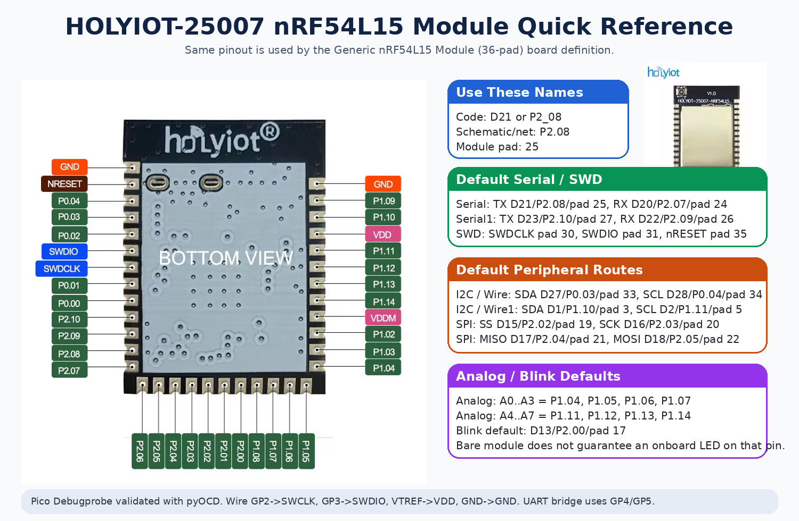

# HOLYIOT-25007 Module Reference

This page documents the shared 36-pad module variant used by:

- `HOLYIOT-25007 nRF54L15 Module`
- `Generic nRF54L15 Module (36-pad)`

## Images

  

## Naming Rule

Use three different names for three different jobs:

- `P2_08`, `P1_10`, `P0_03`: MCU GPIO identity in code and schematics
- `D21`, `D1`, `D27`: Arduino aliases in sketches
- `pad 25`, `pad 3`, `pad 33`: physical module pads for soldering only

Example:

- `pad 25 = P2.08 = P2_08 = D21`

## Default Peripheral Routes

| Peripheral | Default pins |
|---|---|
| `Serial` | `TX=D21/P2.08/pad 25`, `RX=D20/P2.07/pad 24` |
| `Serial1` | `TX=D23/P2.10/pad 27`, `RX=D22/P2.09/pad 26` |
| `Wire` | `SDA=D27/P0.03/pad 33`, `SCL=D28/P0.04/pad 34` |
| `Wire1` | `SDA=D1/P1.10/pad 3`, `SCL=D2/P1.11/pad 5` |
| `SPI` | `SS=D15/P2.02/pad 19`, `SCK=D16/P2.03/pad 20`, `MISO=D17/P2.04/pad 21`, `MOSI=D18/P2.05/pad 22` |
| `LED_BUILTIN` | `D13/P2.00/pad 17` |

## Arduino Pin Map

| Arduino pin | MCU pin | Module pad | Notes |
|---|---|---:|---|
| `D0` | `P1.09` | `2` | GPIO |
| `D1` | `P1.10` | `3` | `Wire1 SDA` |
| `D2` | `P1.11` | `5` | `Wire1 SCL` |
| `D3` | `P1.12` | `6` | `A5` / `PDM CLK` |
| `D4` | `P1.13` | `7` | `A6` / `PDM DATA` |
| `D5` | `P1.14` | `8` | `A7` |
| `D6` | `P1.02` | `10` | GPIO |
| `D7` | `P1.03` | `11` | GPIO |
| `D8` | `P1.04` | `12` | `A0` |
| `D9` | `P1.05` | `13` | `A1` |
| `D10` | `P1.06` | `14` | `A2` |
| `D11` | `P1.07` | `15` | `A3` |
| `D12` | `P1.08` | `16` | GPIO |
| `D13` | `P2.00` | `17` | default Blink/demo pad |
| `D14` | `P2.01` | `18` | GPIO |
| `D15` | `P2.02` | `19` | `SPI SS` |
| `D16` | `P2.03` | `20` | `SPI SCK` |
| `D17` | `P2.04` | `21` | `SPI MISO` |
| `D18` | `P2.05` | `22` | `SPI MOSI` |
| `D19` | `P2.06` | `23` | GPIO |
| `D20` | `P2.07` | `24` | `Serial RX` |
| `D21` | `P2.08` | `25` | `Serial TX` |
| `D22` | `P2.09` | `26` | `Serial1 RX` |
| `D23` | `P2.10` | `27` | `Serial1 TX` |
| `D24` | `P0.00` | `28` | GPIO |
| `D25` | `P0.01` | `29` | GPIO |
| `D26` | `P0.02` | `32` | GPIO |
| `D27` | `P0.03` | `33` | `Wire SDA` |
| `D28` | `P0.04` | `34` | `Wire SCL` |

Analog aliases:

- `A0=P1.04/D8`
- `A1=P1.05/D9`
- `A2=P1.06/D10`
- `A3=P1.07/D11`
- `A4=P1.11/D2`
- `A5=P1.12/D3`
- `A6=P1.13/D4`
- `A7=P1.14/D5`

## Built-in LED Behavior

The bare module variant sets:

- `LED_BUILTIN = D13 = P2.00 = pad 17`

That is a practical default for `Blink`, external LED bring-up, and test clips.
It does **not** mean the bare module has a guaranteed onboard LED on that pin.

## External Programmer Note

The module boards default to:

- `Upload Method = pyOCD (CMSIS-DAP, Default)`

That path is validated with Raspberry Pi Pico Debugprobe.

Expected Pico Debugprobe wiring:

- `GP2 -> SWCLK`
- `GP3 -> SWDIO`
- `VTREF -> VDD`
- `GND -> GND`
- optional: `GP1 -> nRESET`

Optional UART bridge wiring for `Tools > Serial Routing = Header UART`:

- target `D21/P2.08` -> Pico `GP5`
- target `D20/P2.07` -> Pico `GP4`
- common `GND`
