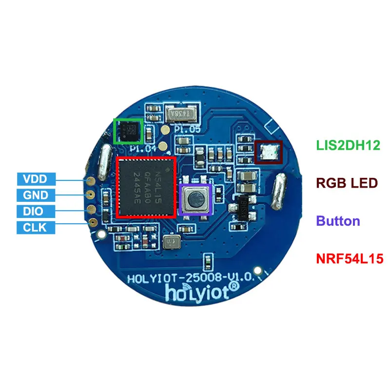
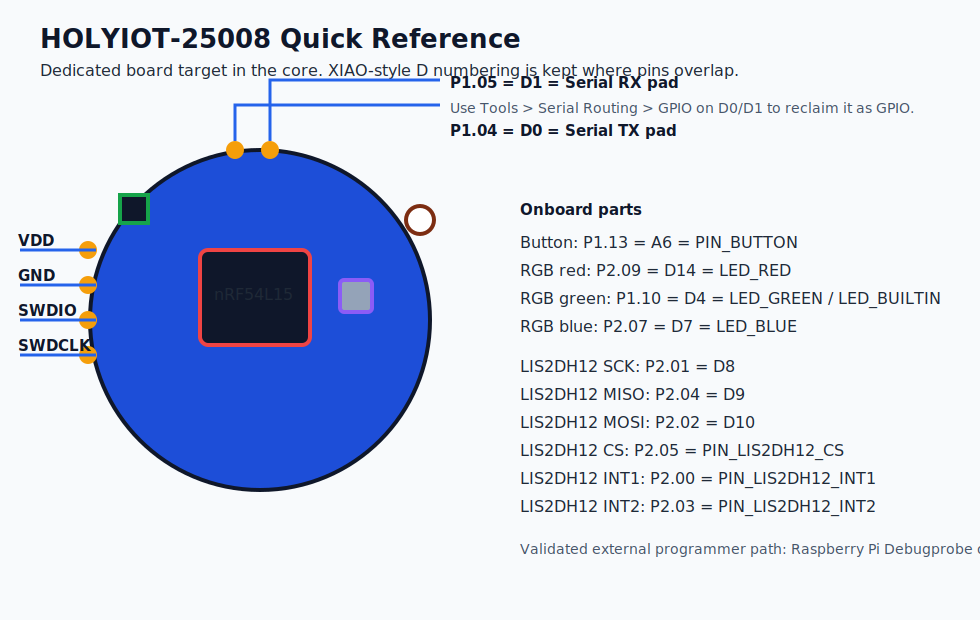

# HOLYIOT-25008 Module Reference

This page documents the dedicated `HOLYIOT-25008 nRF54L15 Module` board target.

The board is not just a bare 36-pad module. It has three onboard peripherals
that now have first-class aliases in the core:

- button
- RGB LED
- LIS2DH12 accelerometer

## Images

  

## Board Selection

Use:

- `HOLYIOT-25008 nRF54L15 Module`

Default upload method:

- `pyOCD (CMSIS-DAP, Default)`

Validated external programmer path:

- Raspberry Pi Debugprobe on Pico: <https://github.com/raspberrypi/debugprobe>

## Serial Pad Routing

The two top pads are routed as:

| Pad | MCU pin | Arduino pin | Default role |
|---|---|---|---|
| top pad 1 | `P1.04` | `D0` | `Serial TX` |
| top pad 2 | `P1.05` | `D1` | `Serial RX` |

Tools menu options:

- `Header UART on D0/D1 (Default)`
- `GPIO on D0/D1 (Serial disabled)`

When `Serial disabled` is selected, the core keeps `Serial` and `Serial1`
link-compatible but disconnected, so sketches still compile while `D0` and `D1`
stay free for normal GPIO use.

## Onboard Peripheral Map

### RGB LED

| Channel | MCU pin | Arduino alias |
|---|---|---|
| red | `P2.09` | `D14` / `LED_RED` |
| green | `P1.10` | `D4` / `LED_GREEN` / `LED_BUILTIN` |
| blue | `P2.07` | `D7` / `LED_BLUE` |

Notes:

- all three LED channels are active low
- `LED_BUILTIN` is mapped to the onboard green channel on this board

### Button

| Function | MCU pin | Arduino alias |
|---|---|---|
| push button | `P1.13` | `PIN_BUTTON` / `A6` |

Notes:

- active low
- use `pinMode(PIN_BUTTON, INPUT_PULLUP)`

### LIS2DH12 accelerometer

| Signal | MCU pin | Arduino alias |
|---|---|---|
| `SCK` | `P2.01` | `D8` / `PIN_LIS2DH12_SCK` |
| `MISO` | `P2.04` | `D9` / `PIN_LIS2DH12_MISO` |
| `MOSI` | `P2.02` | `D10` / `PIN_LIS2DH12_MOSI` |
| `CS` | `P2.05` | `PIN_LIS2DH12_CS` |
| `INT1` | `P2.00` | `PIN_LIS2DH12_INT1` |
| `INT2` | `P2.03` | `PIN_LIS2DH12_INT2` |

Notes:

- the onboard accelerometer is wired to `SPI`, not `Wire`
- the board examples use `SPI.setPins(...)` with the onboard LIS2DH12 routes

## XIAO-style Compatibility

The dedicated 25008 variant still keeps the shared XIAO/module Arduino pin
numbering on overlapping pins, so generic XIAO-oriented sketches remain much
closer to source-compatible:

- `D0..D15` keep the shared numbering
- XIAO helper symbols remain available so sketches still compile
- antenna-selection helpers stay as harmless no-ops, while BLE/Zigbee RF-path
  ownership is emulated in software for the board's fixed antenna path

That means:

- shared-pin sketches port cleanly
- onboard 25008 hardware still has useful aliases instead of hiding behind raw
  GPIO numbers

## Built-in Examples

Board-package examples added for this board:

- `File -> Examples -> Boards -> Holyiot25008RgbButton`
- `File -> Examples -> Boards -> Holyiot25008Lis2dh12Spi`
- `File -> Examples -> Boards -> Holyiot25008UartPadsAsGpio`
